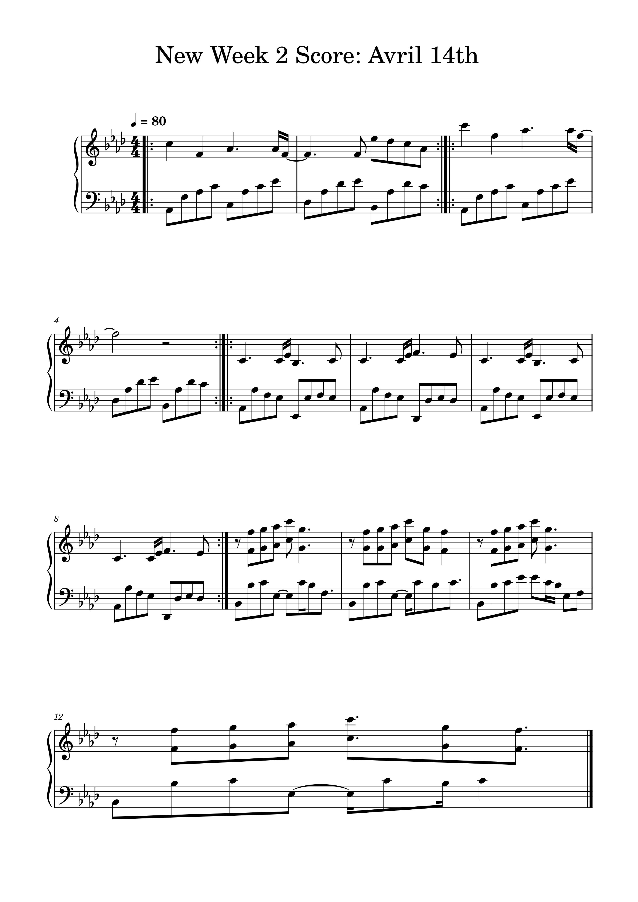

# Week 2
For week twos task I transcribed Aphex Twins song Avril 14th. It was written, composed, and preformed by him. The piece is originally preformed on the piano, so to retain authenticity, I also transcribed the piece on the piano. Since I transcrcibed the score fully from scratch on MuseScore, I found the procecss slightly tricky. I found it quite tedious inputting every note individually, but once I learnt the workings of the software I found it less difficult.

Here is a link to the MuseCore file. 

Below is a screenshot of the 12 bars I transcribed. 
 
