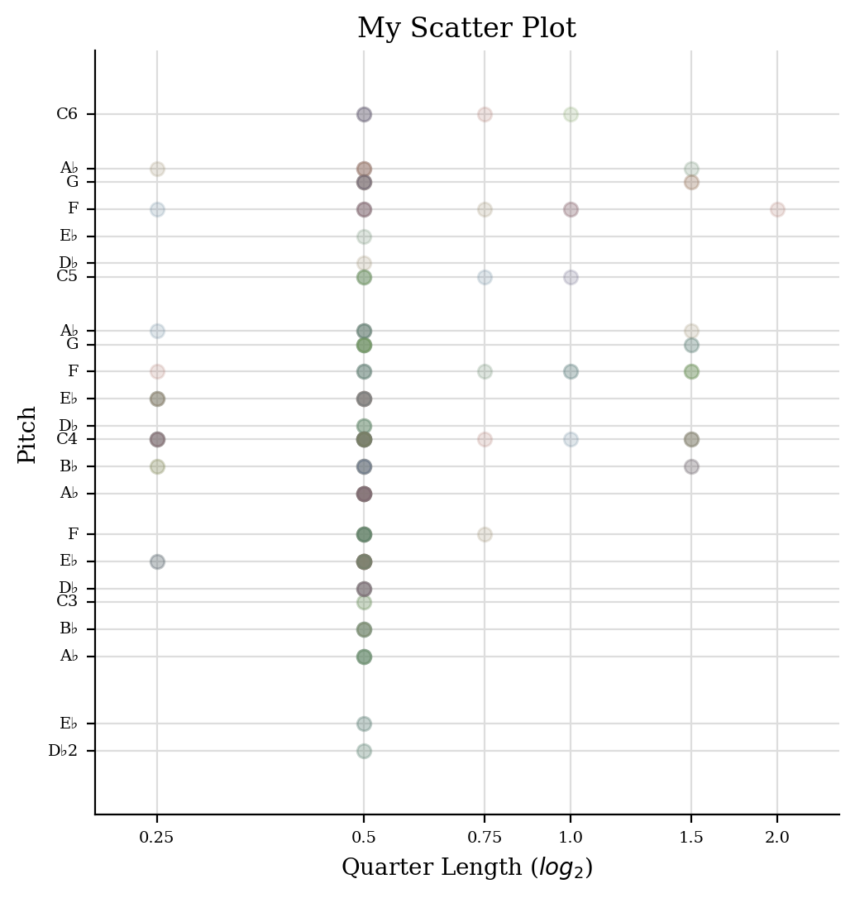
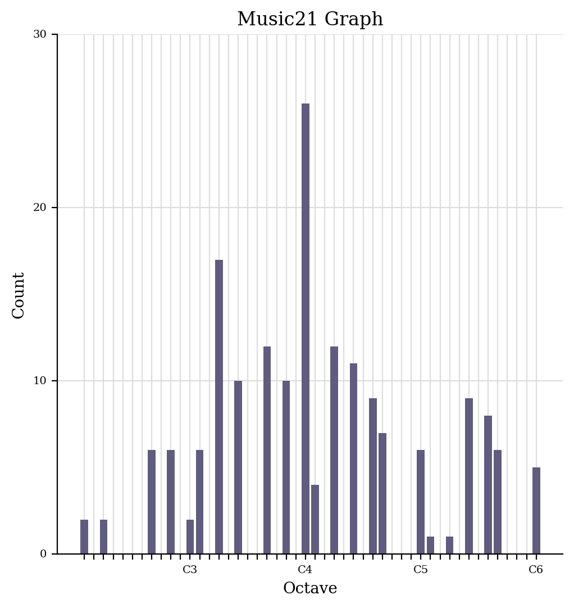

# Week 4

## Task 1

## Task 2
[Here](chords.xml) I have attached a file of the chords I extracted from my transcribed score. 

[Here](ChordAnalysis.xml) I have attached the harmonic analysis of my chords.

### Graph 1: Piano Roll
Below is my pieces extracted piano roll. It shows what pitches are played and for what duration they are played within a meausre across a piece of music. The notes in this graoh specifically are quite spaced out and less densely packed, indicating a less active rhythm.

 

### Graph 2: Scatter Plot of Pitches
Below is my pieces scatter plot of pitches. The graph plots pitch against note length. With most of the dots of the graph being to the left and centre, it means that the piece frequently uses shorter notes. 

 

### Graph 3: Pitch Histogram
Below is my pieces pitch histogram. It shows the number of times a note is played in a piece. This graph tells us that moost of the nootes occur at a C4 octave, so the peice centres around the middle register. 

 
